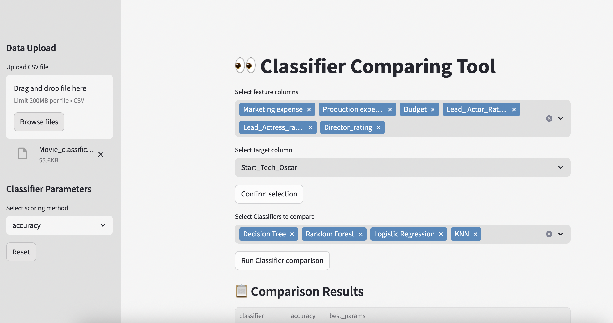
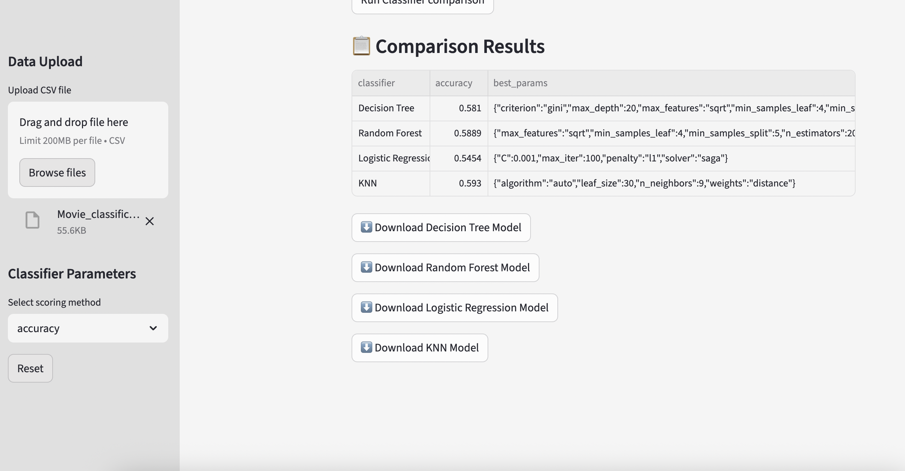

# Classifier Comparing Tool

A leightweight Streamlit web app to compare multiple machine learning classifiers on your datasets with automated hyperparameter tuning and scoring options. Easily expandable.

## Quick Start

1. Install dependencies:
    ```bash
    pip install -r requirements.txt
    ```

2. Run the app:
    ```bash
    streamlit run app.py
    ```

3. Upload CSV data, select features/target, choose classifiers, and compare results.

## Supported Classifiers

- Decision Tree
- Random Forest  
- K-Nearest Neighbors (KNN)
- Logistic Regression

easily expandable in the ml_handler.py

## Features

- Web-based interface for easy data upload
- Automated hyperparameter tuning with GridSearchCV
- Model comparison with accuracy, F1, or recall metrics
- Download trained models

## Usage

1. Upload your CSV file via the sidebar
2. Select feature columns and target column
3. Choose classifiers to compare
4. View results table with performance metrics
5. Download models for later use

## Screenshots



